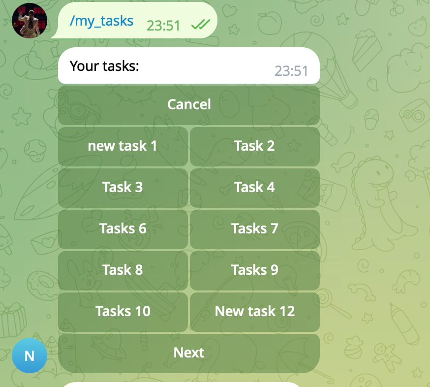
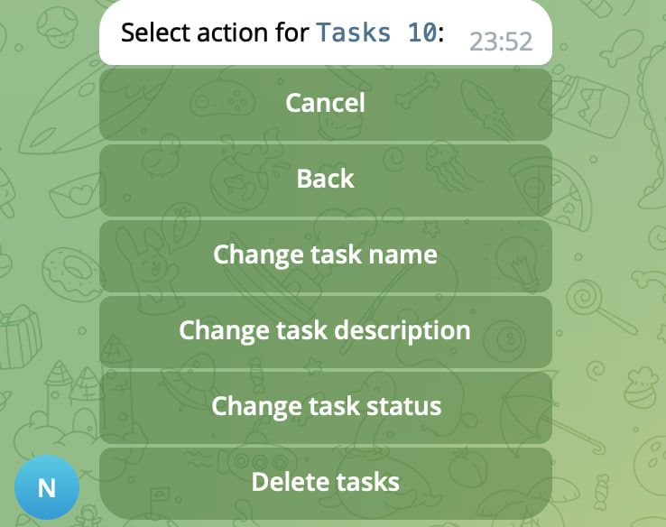

# Test-TG-Bot

# Содержание

- [Общее описание задачи и ее контекста](#общее-описание-задачи-и-ее-контекста)
- [Обзор выбранных технологий и инструментов](#обзор-выбранных-технологий-и-инструментов)
- [Архитектура приложения](#архитектура-приложения)
- [Описание основных классов и функций](#описание-основных-классов-и-функций)
- [Примеры использования бота описание функциональностей](#примеры-использования-бота-описание-функциональностей)
- [Структура бд и запросы](#структура-бд-и-запросы)
- [Инструкция по развертыванию и запуску приложения](#инструкция-по-развертыванию-и-запуску-приложения)


## Общее описание задачи и ее контекста
Telegram бот создан для управления задачами и взаимодействия с пользователями. Основной функционал бота:
- Регистрация пользователей через Telegram
- Создание, просмотр, редактирование и удаление задач
- Хранение состояния пользователя для управления пошаговыми процессами
- Обеспечение интуитивного взаимодействия с пользователями с помощью сообщений, постоянного меню и инлайн-кнопок

Бот взаимодействует с базами:
- Redis для FSM
- PSQL для хранения данных


## Обзор выбранных технологий и инструментов
Для реализации бота были выбраны следующие технологии:
- Python - Основной язык разработки
- Pyrogram - Фреймворк для взаимодействия с Telegram API
- SQLAlchemy - ORM для работы с базой данных
- PSQL - База данных для хранения пользователей и задач
- Redis - Хранилище состояний (FSM) для управления пошаговыми процессами
- Pydantic - Для управления конфигурацией
- Docker - Для развертывания приложения


## Архитектура приложения

Бот имеет модульную архитектуру с разделением на следующие компоненты:

Основной модуль:
- Инициализация клиента Pyrogram
- Запуск бота

Модуль базы данных:
- Управление подключением к PSQL
- CRUD-операции для работы с пользователями и задачами

Модуль FSM:
- Хранение и управление состояниями пользователей с помощью redis

Основные обработчики:
- Регистрация пользователей
- Управление задачами (создание, просмотр, редактирование, удаление)

Модуль вспомогательных функций:
- Декораторы:
    - обработка ошибок для логирования и отправки уведомлений пользователям
- Мелкие вспомогательные функции, по типу разбиения списка

### Диаграмма компонентов и взаимодействий

```
[Telegram API] <--> [Pyrogram Client] <--> [Handlers] <--> [FSM]
                                                       |-- [Database Models]
```


## Описание основных классов и функций
Основные классы:

Database:
- Управляет подключением к базе данных PSQL 

CRUD:
- Реализует операции создания, чтения, обновления и удаления для пользователей и задач

FSMStorage:
- Хранилище состояния пользователей
- Использует redis

RegistrationHandler:
- Обрабатывает регистрацию пользователей
- Управляет состояниями регистрации через FSM
- Также взаимодействует с базой данных

TaskHandler:
- Обрабатывает создание, редактирование, просмотр и удаление задач
- Управляет состояниями задач через FSM
- Также взаимодействует с базой данных
- Реализует взаимодействие с пользователями через инлайн-кнопки, постоянного меню и сообщений

TaskState и RegistrationState:
- Определяют возможные состояния пользователей в процессе работы

Основные функции (вне хендлеров):

state_filter:
- Создает пользовательский фильтр для проверки текущего состояния пользователя, с последующим вызовом нужного метода из разных обработчиков

error_handler:
- Декоратор для обработки ошибок, логирования и отправки уведомлений об ошибках


## Примеры использования бота, описание функциональностей

### Регистрация пользователя
- Пользователь отправляет команду /start
- Бот проверяет наличие пользователя в базе данных:
    - Если пользователь уже зарегистрирован, отправляется соответствующее уведомление
    - Если пользователь не найден, запускается процесс регистрации с запросом имени и логина
- Проверка введенных данных:
    - Проверяет, что введенный логин не существует в базе. Если такой имеется, просит выбрать другой
Строгую валидацию не добавлял, но о ней помнил и задумывался

### Управление задачами
- Создание задачи:
    - Команда в постоянном меню /create_task запускает процесс создания задачи
    - Пользователь вводит название и описание задачи. Задача создается в два этапа
    - Задача сохраняется в базе данных

- Просмотр задач:
    - Команда в постоянном меню /my_tasks отображает список задач (показываем названия задач) пользователя с пагинацией. В каждой странице показывается по 10 задач. Есть возможность перемещаться вперед и назад по страницам
    

- Редактирование задачи:
    - Пользователь может изменить название, описание или статус задачи через инлайн-кнопки
    
    - Для смены статуса, пользователю показываем список со статусами. Список это один из атрибутов класса обработчика. Текущий статус задачи выбрать нельзя, только новый (или отменить действие по смене статуса)

- Удаление задачи:
    - Пользователь выбирает задачу и подтверждает удаление через инлайн-кнопки

### FSM (Finite State Machine)
- Используется для пошагового управления процессами (например, регистрация, создание или редактирование задачи)
- Состояния хранятся в redis и очищаются после завершения процесса

###  Логирование и обработка ошибок
- Все ошибки логируются для последующего анализа
- При возникновении ошибки пользователь получает уведомление


## Структура бд и запросы

### Таблица Users

| Поле       | Тип          | Описание                      |
|------------|--------------|-------------------------------|
| `id`       | Integer      | Уникальный идентификатор      |
| `login`    | String(255)  | Логин пользователя            |
| `username` | String(255)  | Имя пользователя              |
| `tg_user_id` | BigInteger | Telegram ID пользователя (уникальный)      |
| `status`   | String(10)    | Статус пользователя           |
| `created_at` | TIMESTAMP  | Дата и время регистрации      |

### Таблица Tasks

| Поле         | Тип          | Описание                      |
|--------------|--------------|-------------------------------|
| `id`         | Integer      | Уникальный идентификатор задачи  |
| `name`       | String(50)  | Название задачи               |
| `description`| Text         | Описание задачи               |
| `tg_user_id` | BigInteger   | Telegram ID пользователя      |
| `status`     | String(6)    | Статус задачи                 |
| `created_at` | TIMESTAMP    | Дата создания                 |
| `last_update`| TIMESTAMP    | Дата последнего обновления    |

Запросы в бд осуществляются через ORM SQLAlchemy. В crud классе реализуются операции: создания, чтения, обновления и удаления для пользователей и задач.  

## Инструкция по развертыванию и запуску приложения

Для развертывания приложения нужно:
- Создать или использовать существующего бота. Бота можно создать через телеграм бот `@BotFather`
- [Зарегистрировать](https://my.telegram.org/auth) приложение и получить креды для работы с Pyrogram
- Склонировать приложения из гита
- После клонирования, перейти в директорию, создать и заполнить .env файл с переменными окружения. Существует шаблонный файл, который подскажет, какие креды нужны. Для работы с redis и PSQL можно создать новые креды.  ⚠️Примечание в main.py на 69 строке, есть функция `run_migrations`, которая запускает миграции, а именно, создает нужные таблицы (если они еще не созданы) для работы бота.
- Запустить команду `docker-compose -f docker-compose.yml up -d --build`
- Проверить рабочие контейнеры `docker ps`
- Перейти в бота и начать взаимодействовать с ним